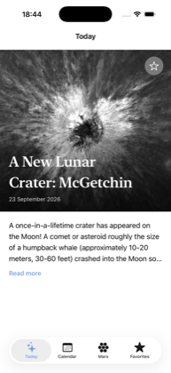
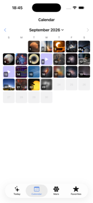
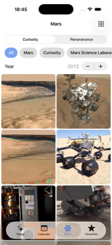
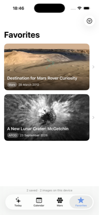
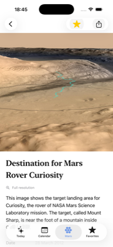

<div align="center">


# Astra

**A NASA astronomy explorer for iOS — built so every favourited picture still opens with no connection at all.**

<sub>SwiftUI · SwiftData · async/await · iOS 26 · no third-party dependencies</sub>

</div>

---

## Screens

| Today | Calendar | Mars |
|:--:|:--:|:--:|
|  |  |  |
| Astronomy Picture of the Day; tap Astra in the corner for a space fact | A whole month in one request, tap the title to jump to any month back to 1995 | 100 results in a lazy grid, filtered by rover, keyword and year |

| Favorites | Detail |
|:--:|:--:|
|  |  |
| Reads from disk, never the network — this screen works in Airplane Mode | Parallax header, pinch zoom, full-resolution crossfade, in-app video |

---

## What it does

- **Astronomy Picture of the Day** — today's image, or any day back to 16 June 1995
- **Month calendar** — one request per month, thumbnails for every published day
- **Mars gallery** — searchable NASA imagery, filtered by rover, keyword and year
- **Favourites that survive anything** — force quit it, turn off the network, relaunch: the pictures are still there
- **Videos play in the app** — roughly one APOD in ten is a film, and none of them leave the app to play

---

## Getting it running

```bash
git clone https://github.com/Kimmy213/Astra.git
cd Astra
cp Astra/Secrets.example.swift Astra/Secrets.swift
```

Then put your own key into `Astra/Secrets.swift`:

```swift
enum Secrets {
    static let nasaAPIKey = "YOUR_KEY_HERE"
}
```

Keys are free and instant from [api.nasa.gov](https://api.nasa.gov) — name and email, no approval wait. `DEMO_KEY` works but is capped at 30 requests an hour, which a single month in the Calendar will exhaust.

`Secrets.swift` is gitignored and excluded from the build target, so your key never reaches the repository.

Open `Astra.xcodeproj` and run. Requires Xcode 26 and iOS 26.

---

## How it is put together

```
Astra/
├── Networking/      building URLs, making requests, turning failures into readable errors
├── Models/
│   ├── DTO/         structures matching the JSON on the wire
│   └── Persistence/ SwiftData models that live in the database
├── Storage/         image files on disk, and the favourites lifecycle
├── ViewModels/      one LoadState per screen
├── Views/           five screens and the reusable pieces
└── Support/         calendar, theme, shared helpers
```

Folders follow responsibility rather than screen, because the networking and storage layers are shared by several screens.

Three rules held throughout:

- **Data flows one way.** Views read state from view models, view models call the client, the client returns DTOs. Nothing calls back upward.
- **Failure is a value you can see.** Every screen switches over a `LoadState` with `loading`, `loaded` and `failed`, so the compiler makes a missing error state impossible.
- **No force unwrapping in the networking path.** No `try!`, no crash-prone `!`.

---

## Decisions worth explaining

**Why not `AsyncImage`?** It has no disk cache, so scrolling a grid back up re-downloads everything that left the screen. `AsyncCachedImage` goes through a three-tier store instead. Measured, not assumed — the same filters loaded twice with a force quit in between:

| Run | From network | From disk |
|---|---|---|
| Cold container, never browsed | 15 images | 0 |
| After force quit, same filters | 0 | 15 images |

**Why the Calendar is fast.** Each cell was downloading the full-size photograph to draw a 120-point thumbnail — and one day last August is a 16 MB GIF. APOD publishes a 4 KB thumbnail per day on its own archive pages, so that loads first and the real picture crossfades in behind it. A whole month of thumbnails is 208 KB, and the grid fills in under a second instead of about twelve.

An obvious fix was tried first and thrown away after measuring: capping simultaneous downloads made it *slower*, 19.3 s against 12.2 s. Downloading less was the lever, not downloading more politely.

**Why favourites survive Airplane Mode.** A URL in a database is not a saved picture. Favouriting downloads the image into `Documents/Favorites/`, which iOS never purges, and `LocalImageView` has no network path at all. Unfavouriting deletes the row and the file together, so nothing is orphaned on disk.

**Why `NASAClient` is an actor.** It holds a shared `JSONDecoder`, which is not safe to use from several threads at once, and the gallery fires a new request on every filter change.

---

## Tested, not assumed

- **Persistence** — relaunched with a `URLProtocol` failing *every* request, which is stricter than Airplane Mode because it defeats any hidden URL cache. All favourites still rendered, and the file count on disk matched the row count.
- **Accessibility** — checked at the largest Dynamic Type size; the Today screen moves its title below the picture rather than covering it.
- **Dark mode and iPad** — both verified on device, with layouts that respond to the horizontal size class.

---

## Built with

Apple frameworks only, as required — SwiftUI, SwiftData, AVKit, WebKit, ImageIO, CryptoKit. No SPM packages, no CocoaPods.

APIs: [APOD](https://api.nasa.gov) and the [NASA Image and Video Library](https://images.nasa.gov).

> The brief specified the Mars Rover Photos API. It is offline — `api.nasa.gov/mars-photos/…` and its origin `mars-photos.herokuapp.com` both return Heroku's "No such app" page for every path. The Image and Video Library replaced it while keeping the same screen: the rover picker became the search term, the camera chips became keyword filters, and the sol stepper became a year.

---

<div align="center">
<sub>IOS Development — Project 02</sub>
</div>
